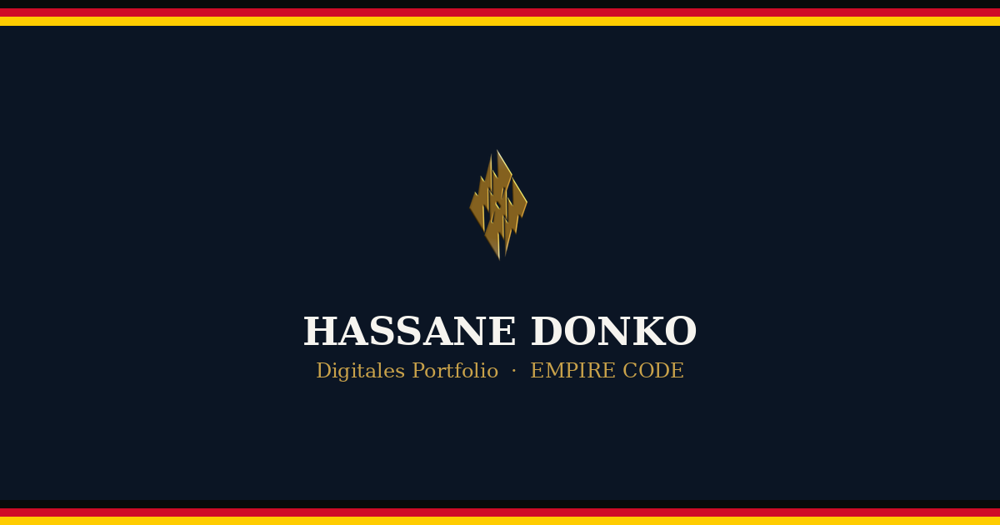

    
  <b>PORTFOLIO HUB</b> 

  
  
  
  

---

  
  <a href="#-deutsch">🇩🇪 Deutsch</a>

---

## 🇩🇪 Deutsch

**Portfolio Hub** ist die zentrale digitale Anlaufstelle von Hassane Donko: eine einzige, responsive Seite, die direkt zu allen selbst entwickelten Anwendungen sowie zum vollständigen GitHub-Profil führt.

🔗 **Live-Seite:** [donko-dev.github.io/portfoliohub](https://donko-dev.github.io/portfoliohub/)

Die Seite wurde gezielt für die Vorlage bei Ausbildungsbetrieben, dem Auslandsportal, Botschaften und weiteren offiziellen Stellen konzipiert. Ein einziger QR-Code genügt, um direkt auf dieser Seite zu landen und von dort aus jede Anwendung einzeln zu öffnen.

### Enthaltene Anwendungen

| Anwendung | Beschreibung |
|---|---|
| **DONKO Deutschland Beruf** | Zentrale digitale Roadmap des gesamten Werdegangs nach Deutschland |
| **Smart Logistics** | Offline-fähiges Lagerverwaltungssystem (WMS) mit ABC-Analyse |
| **Kalcul-pro** | Serverlose Software für Warenwirtschaft, Kasse und Margenberechnung |
| **Bruckedeoffline (BDE)** | Offline-Anwendung zum eigenständigen Erlernen der deutschen Sprache |
| **ALB2 — Ausbildung Logistics B2** | Offline-PWA für Berufsdeutsch in der Lagerlogistik (A1–C2) |
| **GitHub-Profil** | Vollständiges Entwicklerprofil mit allen Softwareprojekten |

### Technische Merkmale

- 100 % responsives Design (Mobil, Tablet, Desktop)
- Installierbar als PWA (Manifest + Service Worker)
- Offline-Grundfunktion durch zwischengespeicherte Inhalte
- Umschaltbares helles/dunkles Design
- Open-Graph-Vorschau für das Teilen des Links

---

  
    
  <b>Bereitgestellt von EMPIRE CODE</b> 
  Alle Rechte vorbehalten
    
  <i>Freiberuflicher IT-Entwickler — Spezialist für Lager- und Logistikmanagementsysteme · Blockchain · Krypto · Web3 · KI-Experte</i>
    

